# 🗺️ The Loom - Complete Workflow Diagrams

> Visual reference for all workflows in The Loom storytelling framework.

---

## 📑 Table of Contents

1. [Manga Workflows](#manga-workflows)
   - [Manga Import (Folder)](#manga-import-folder)
   - [Manga Import (CBZ)](#manga-import-cbz)
   - [Story Extraction from Manga](#story-extraction-from-manga)
   - [Manga Reading](#manga-reading)
2. [Story Graph Workflows](#story-graph-workflows)
   - [Graph Node Management](#graph-node-management)
   - [Branch Lifecycle](#branch-lifecycle)
   - [Story Extraction & Scene Creation](#story-extraction--scene-creation)
3. [AI Generation Workflows](#ai-generation-workflows)
   - [Text Generation (Writer Agent)](#text-generation-writer-agent)
   - [Image Generation (Artist Agent)](#image-generation-artist-agent)
4. [Ingestion Workflows](#ingestion-workflows)
   - [Text Document Ingestion](#text-document-ingestion)
   - [Manga Page Ingestion](#manga-page-ingestion)
5. [Dual-View Workflows](#dual-view-workflows)
   - [Text-Image Sync](#text-image-sync)
   - [Director Mode Editing](#director-mode-editing)
6. [System Workflows](#system-workflows)
   - [LLM Configuration](#llm-configuration)
   - [Accessibility & Mobile](#accessibility--mobile)

---

## Manga Workflows

### Manga Import (Folder)

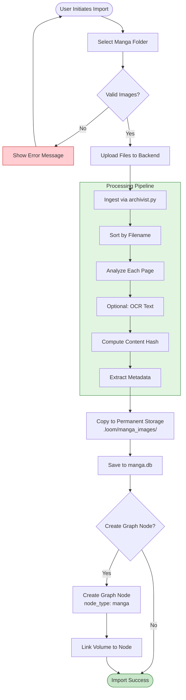

**Key Files:**
- `ui/src/components/MangaFolderImport.tsx` - UI component
- `agents/archivist.py` - Ingestion logic
- `core/manga_storage.py` - Storage layer
- `ui/api.py` - API endpoints

---

### Manga Import (CBZ)

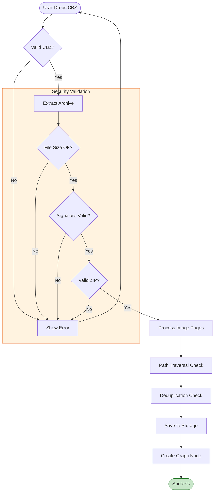

---

### Story Extraction from Manga

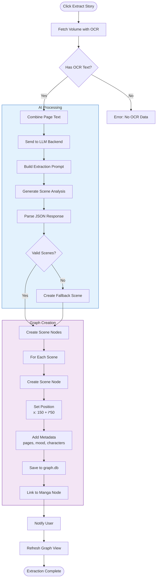

**API Endpoint:** `POST /api/manga/{volume_id}/extract-story`

---

### Manga Reading

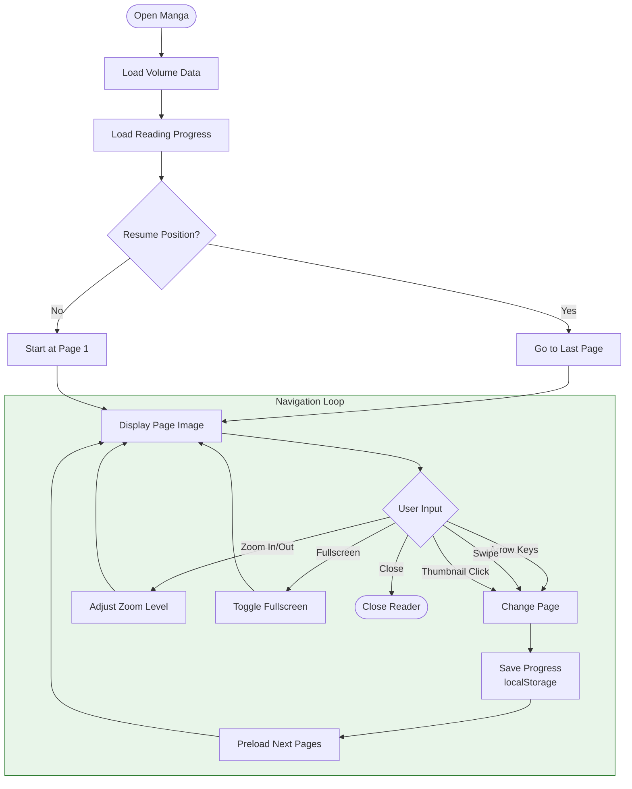

---

## Story Graph Workflows

### Graph Node Management

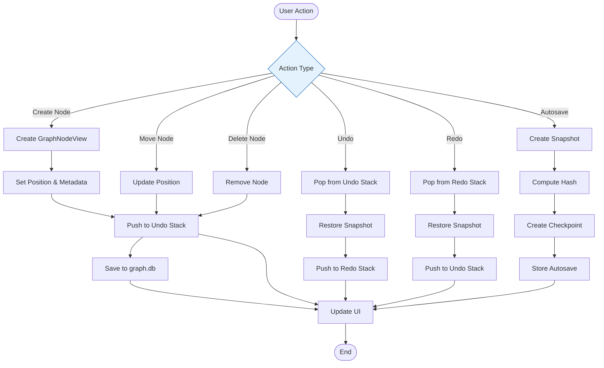

---

### Branch Lifecycle

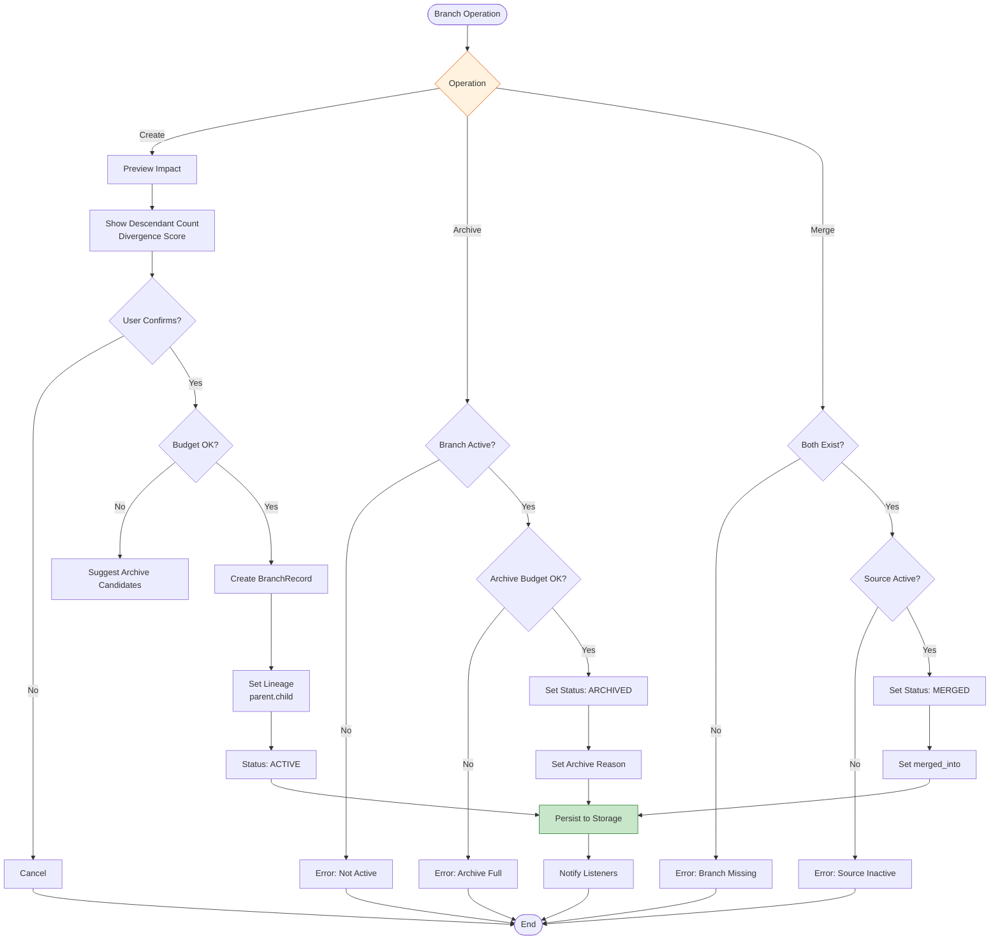

---

### Story Extraction & Scene Creation

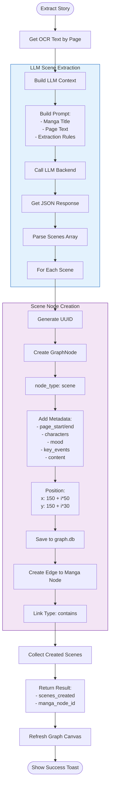

---

## AI Generation Workflows

### Text Generation (Writer Agent)

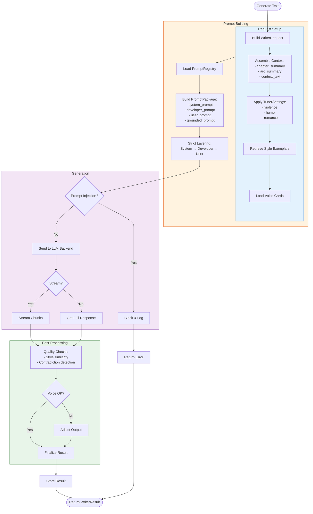

**API Endpoint:** `POST /api/writer/generate`

---

### Image Generation (Artist Agent)

```mermaid
flowchart TD
    Start([Generate Panels]) --> BuildRequest[Build ArtistRequest]
    
    subgraph BlueprintSetup [Scene Blueprint]
        BuildRequest --> Setting[Setting]<br/>TimeOfDay<br/>Weather
        Setting --> Lighting[Lighting:<br/>- direction<br/>- intensity]
        Lighting --> Camera[Camera:<br/>- shot_type<br/>- angle<br/>- focus]
        Camera --> Characters[Characters:<br/>- position<br/>- pose<br/>- expression]
        Characters --> Props[Props]
    end
    
    subgraph Atmosphere [Atmosphere Control]
        BlueprintSetup --> Preset[Select Preset:<br/>- neutral<br/>- tense<br/>- melancholy<br/>- action]
        Preset --> Adjust[Adjust Parameters:<br/>- temperature<br/>- CFG scale<br/>- Steps]
    end
    
    subgraph Generation [Panel Generation]
        Atmosphere --> ForEach[For Each Panel]
        ForEach --> LoadLoRA[Load Character LoRAs]
        LoadLoRA --> Identity[Apply Identity Packs]
        Identity --> Continuity[Apply Continuity:<br/>- Previous panel reference<br/>- Style consistency]
        Continuity --> Generate[Generate Image]
        Generate --> QC[Quality Control]
        QC --> Check{Pass?}
        Check -->|No| Retry[Retry/Adjust]
        Check -->|Yes| Store[Store Artifact]
    end
    
    subgraph Output [Output Assembly]
        Store --> Collect[Collect All Panels]
        Collect --> Scores[Compute Scores:<br/>- overall_quality<br/>- continuity_score]
        Scores --> Package[Package ArtistResult]
    end
    
    Package --> End([Return Result])
    Retry --> Generate
    
    style BlueprintSetup fill:#e3f2fd,stroke:#1565c0
    style Atmosphere fill:#fff3e0,stroke:#e65100
    style Generation fill:#f3e5f5,stroke:#6a1b9a
```

**API Endpoint:** `POST /api/artist/generate-panels`

---

## Ingestion Workflows

### Text Document Ingestion

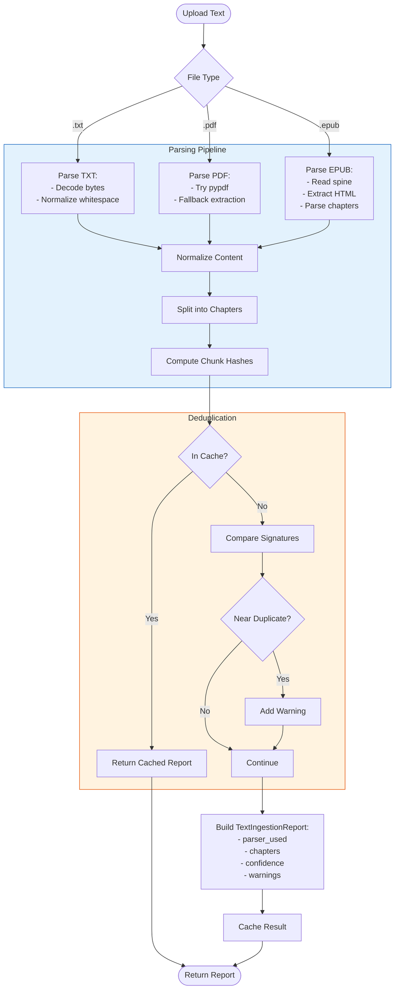

---

### Manga Page Ingestion

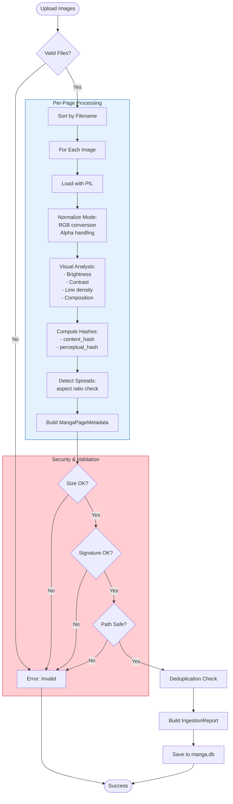

---

## Dual-View Workflows

### Text-Image Sync

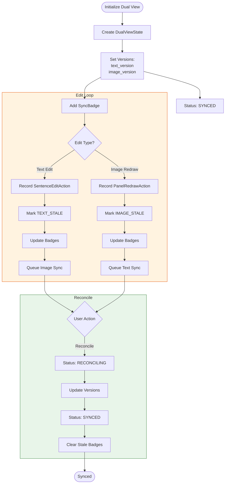

---

### Director Mode Editing

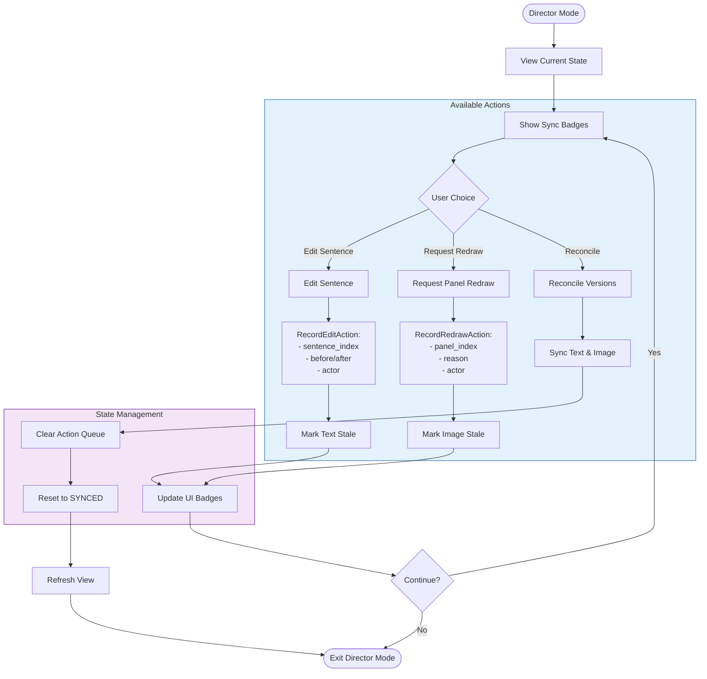

---

## System Workflows

### LLM Configuration

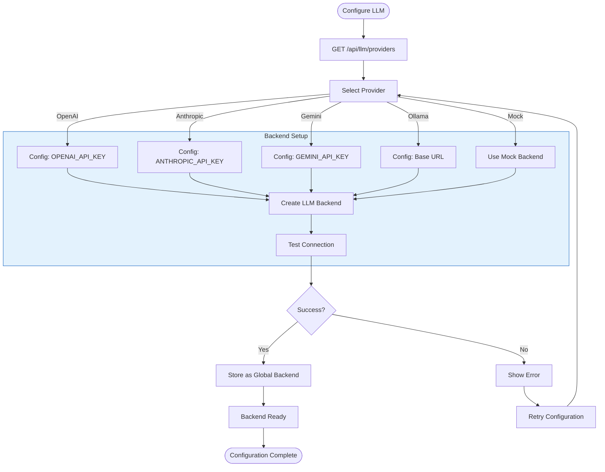

**API Endpoints:**
- `GET /api/llm/providers`
- `POST /api/llm/config`
- `POST /api/llm/test`
- `WS /api/llm/stream/{client_id}`

---

### Accessibility & Mobile

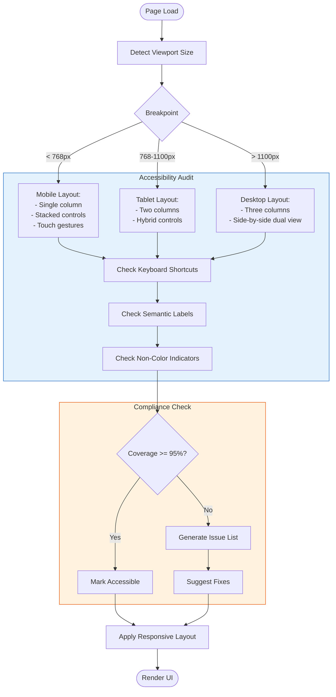

---

## Data Flow Overview

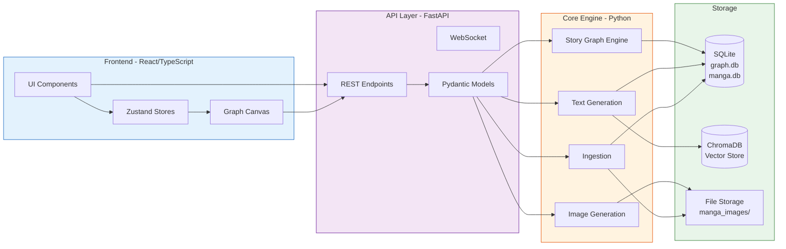

---

## Event Sourcing Flow

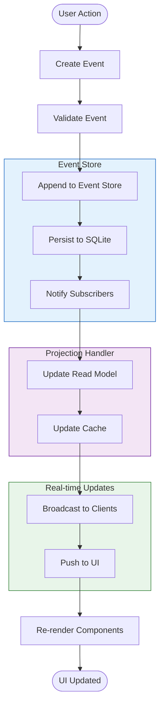

---

## Key Files Reference

| Workflow | Primary Files |
|----------|---------------|
| **Manga Import** | `ui/src/components/MangaFolderImport.tsx`, `agents/archivist.py`, `core/manga_storage.py` |
| **Story Extraction** | `ui/api.py::extract_story_from_manga()`, `core/llm_backend.py` |
| **Manga Reading** | `ui/src/components/ReadingView.tsx`, `ui/src/components/MangaViewer.tsx` |
| **Graph Management** | `core/graph_persistence.py`, `core/story_graph_engine.py`, `ui/src/components/GraphCanvas.tsx` |
| **Text Generation** | `core/text_generation_engine.py`, `agents/writer.py` |
| **Image Generation** | `core/image_generation_engine.py`, `agents/artist.py` |
| **Dual View** | `core/frontend_workflow_engine.py::DualViewManager` |
| **Branching** | `core/story_graph_engine.py::BranchLifecycleManager` |

---

*Generated: 2026-02-10 | The Loom v1.0*
